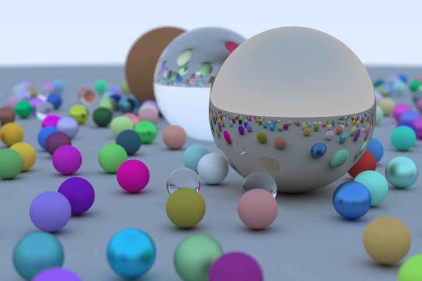

# rustracer

A multi-threaded path tracer written in Rust.

## Features

* Anti-aliasing
* Solid, metal, and glass surfaces
* Adjustable camera
* Depth of field

## Demo

An example 720x480 scene rendered at 400 samples per pixel:

